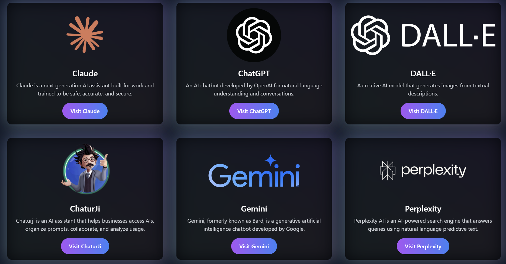

# My Favorite AI Tools

 <!-- Replace with the actual path to your website image in the public folder -->

This project showcases a selection of my favorite AI tools, presented in a visually appealing and interactive format using **React** and **Tailwind CSS**.

## Features

- **Interactive UI**: A clean and modern interface using Tailwind CSS.
- **Animation**: Enhanced user experience with Framer Motion for smooth animations.
- **Responsive Design**: Adapts to different screen sizes for accessibility on all devices.


## Installation

To run this project locally, follow these steps:

1. Clone the repository:
   ```bash
   git clone https://github.com/Yaswanth-Vempuluru-7916/Ai-tools.git
   cd Ai-tools
